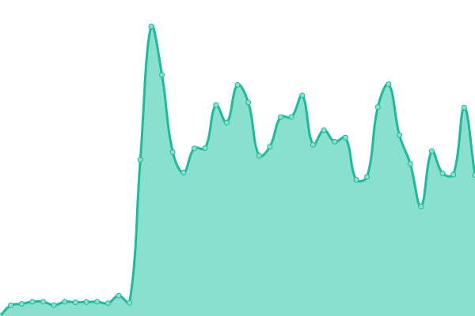
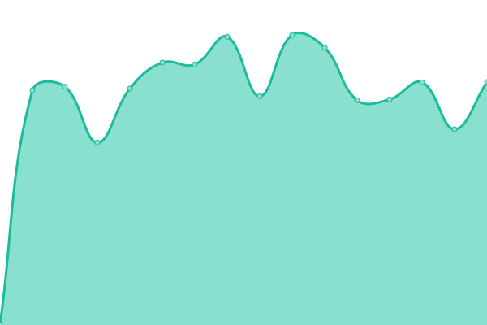
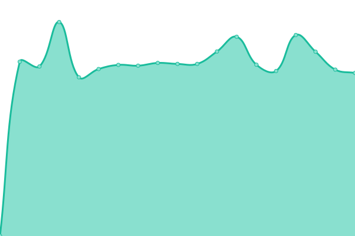
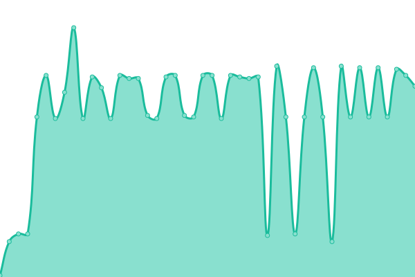
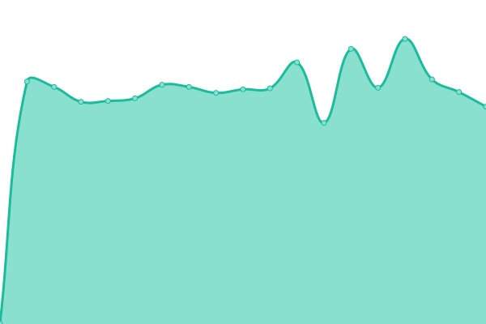

# [📈 Live Status](https://securezeron.github.io/upptime): <!--live status--> **🟩 All systems operational**

This repository contains the open-source uptime monitor and status page for [Zeron](https://www.zeron.one), powered by [Upptime](https://github.com/upptime/upptime).

With [Upptime](https://upptime.js.org), you can get your own unlimited and free uptime monitor and status page, powered entirely by a GitHub repository. We use [Issues](https://github.com/securezeron/upptime/issues) as incident reports, [Actions](https://github.com/securezeron/upptime/actions) as uptime monitors, and [Pages](https://securezeron.github.io/upptime) for the status page.

<!--start: status pages-->
<!-- This summary is generated by Upptime (https://github.com/upptime/upptime) -->
<!-- Do not edit this manually, your changes will be overwritten -->
<!-- prettier-ignore -->
| URL | Status | History | Response Time | Uptime |
| --- | ------ | ------- | ------------- | ------ |
|  [ASM](https://www.google.com) | 🟩 Up | [asm.yml](https://github.com/securezeron/uptime/commits/HEAD/history/asm.yml) | 

 72ms
     
 | 

<a href="https://securezeron.github.io/uptime/history/asm">100.00%</a>
    

|  [Business Posture](https://en.wikipedia.org) | 🟩 Up | [business-posture.yml](https://github.com/securezeron/uptime/commits/HEAD/history/business-posture.yml) | 

 193ms
     
 | 

<a href="https://securezeron.github.io/uptime/history/business-posture">100.00%</a>
    

|  [Compliance](https://news.ycombinator.com) | 🟩 Up | [compliance.yml](https://github.com/securezeron/uptime/commits/HEAD/history/compliance.yml) | 

 391ms
     
 | 

<a href="https://securezeron.github.io/uptime/history/compliance">100.00%</a>
    

|  [Integrations](https://news.ycombinator.com) | 🟩 Up | [integrations.yml](https://github.com/securezeron/uptime/commits/HEAD/history/integrations.yml) | 

 158ms
     
 | 

<a href="https://securezeron.github.io/uptime/history/integrations">100.00%</a>
    

|  [Cloud Monitor](https://news.ycombinator.com) | 🟩 Up | [cloud-monitor.yml](https://github.com/securezeron/uptime/commits/HEAD/history/cloud-monitor.yml) | 

 127ms
     
 | 

<a href="https://securezeron.github.io/uptime/history/cloud-monitor">100.00%</a>
    

|  [VRM](https://www.google.com) | 🟩 Up | [vrm.yml](https://github.com/securezeron/uptime/commits/HEAD/history/vrm.yml) | 

 48ms
     
 | 

<a href="https://securezeron.github.io/uptime/history/vrm">100.00%</a>
    

<!--end: status pages-->

[**Visit our status website →**](https://securezeron.github.io/upptime)

## 📄 License

- Powered by: [Upptime](https://github.com/upptime/upptime)
- Code: [MIT](./LICENSE) © [Anand Chowdhary](https://anandchowdhary.com), supported by [Pabio](https://pabio.com)
- Data in the `./history` directory: [Open Database License](https://opendatacommons.org/licenses/odbl/1-0/)
